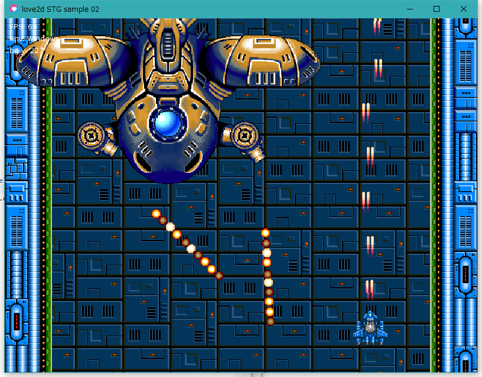
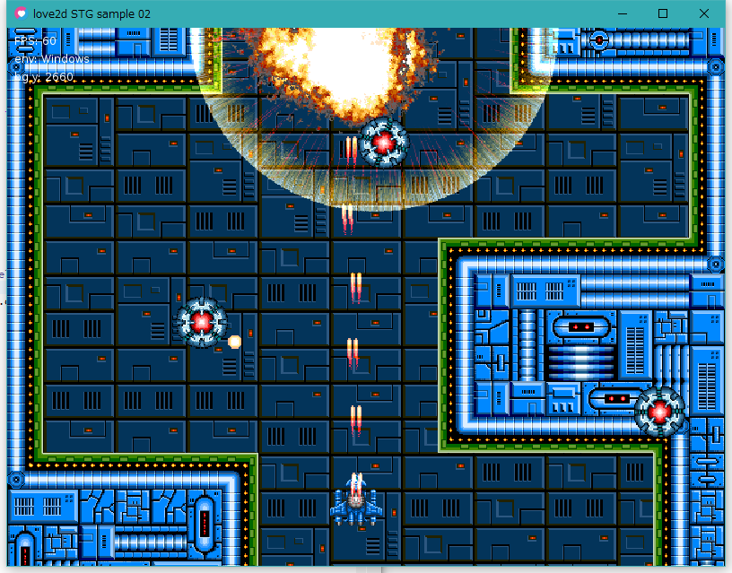

love2d STG sample 02
====================

love2d sample. top view scroll shooting game (shoot'em up). 

Screenshot
-----------

[love2d STG sample on Windows10 x64 + love2d 0.10.2 - YouTube](https://youtu.be/vdmwiL5Rz64)

[love2d STG sample on Raspberry Pi Zero W (raspbian jessie) - YouTube](https://youtu.be/sut33DIe_hg)

Requirement
-----------

* love2d (love) 0.10.2

[LOVE - Free 2D Game Engine](https://love2d.org/)

### Windows

* love 0.10.2

### Raspberry Pi Zero W

* raspbian jessie
* SDL2 2.0.5 (OpenGl ES enable. OpenGL disable)
* love2d 0.10.2
* optional : [shut-term-keys](https://github.com/inoremap/shut-term-keys)

raspbian stretch is not work. SDL2 can not play sound on raspbian stretch.

### Raspberry Pi3

* raspbian jessie or raspbian stretch
* SDL2 (OpenGL enable)
* love2d 0.10.2
* GL driver enable.

Usage
-----

    git clone https://github.com/mieki256/love2d_stg_sample02.git
    love love2d_stg_sample02

How to play
-----------

* move : cursor key or WASD
* toggle gun angle change : Z
* Fullscreen mode change : F11
* Exit : ESC

Use Library
-----------

[karai17/Simple-Tiled-Implementation: Tiled library for LOVE](https://github.com/karai17/Simple-Tiled-Implementation)

License
-------

main.lua, conf.lua, *.png, *.ogg : CC0 / Public Domain

sti(Simple-Tiled-Implementation) library : MIT/X11 Open Source License.

main.lua、conf.lua、png画像、oggファイルのライセンスは CC0 / Public Domain とします。自由に使ってください。ただし、利用/同梱している stiライブラリは MIT/X11ライセンスになっていますので注意してください。

